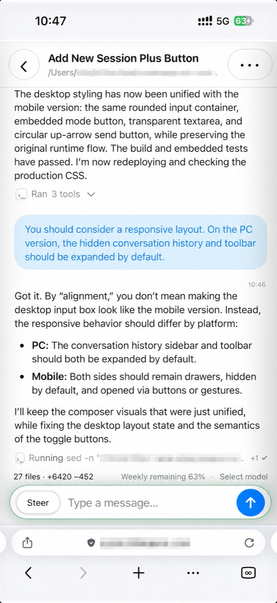
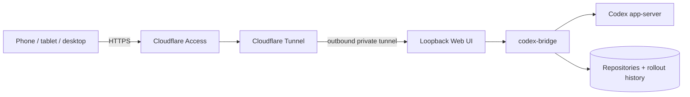

# Codex App Server WebUI for Homelab and NAS

Access OpenAI Codex app-server from a responsive Web UI or CLI running on your homelab, NAS, Mac
mini, or Linux host. Continue the same tasks from any device while Codex stays beside your
repositories.


[Project site](https://gh.bhee.online/codex-bridge/) ·
[Install](docs/install.md) ·
[`codexctl` reference](docs/codexctl.md) ·
[Design](DESIGN.md) ·
[Debugging](DEBUGGING.md)

`codex-bridge` connects directly to app-server and its rollout store. It keeps task history, live
tools and diffs, Queue/Steer/Stop controls, models, and task metadata behind one typed local
protocol—without using the ChatGPT app as a remote-control relay. Keep the Web UI on loopback, or
publish it through Cloudflare Access, a VPN, or an authenticated reverse proxy. Model requests
still use the account and network configured by Codex itself.

## What it provides

- A shared task list and persistent live connection for the Web UI and `codexctl`.
- Structured messages, tool calls, diffs, status, models, and paginated history.
- Remote Queue, Steer, withdrawal, interruption, pinning, renaming, and archiving.
- Editable voice transcription through app-server, with an optional managed local whisper.cpp
  fallback for private Mac, Linux, homelab, and NAS deployments.
- Bounded caches and workspace-scoped downloads for long-running, always-on hosts.

## Release highlights

### v0.3.0 · 2026-09-13

- **Codex-aligned session control:** manage goals, active turns, models, Queue/Steer, run statistics,
  files, and structured tool activity from one typed interface.
- **New reading and exploration tools:** switch to a composer-free history view, collapse or refresh
  the conversation, preview workspace files, zoom images, and turn selected text into a temporary
  focused conversation.
- **Long-session workspace:** open the newest bounded window immediately, expand full turns on
  demand, and keep task overview and runtime architecture available without loading an entire
  rollout into the browser.

See the [latest release notes](docs/releases/v0.3.0.md) or the
[complete release history](docs/releases/).

## Web UI

[Try the interactive demo](https://gh.bhee.online/codex-bridge/demo/). It runs the production Vite
frontend against a live Rust/WASM simulator entirely in the browser. Submit different prompts to
see template-driven progress and structured tools, steer or queue another message while it runs,
withdraw queued work, cancel the run, or try simulated voice-to-text. Demo submissions and images
never contact Codex or leave the page.

[](docs/assets/codex-bridge-mobile.jpg)

The private UI is responsive across mobile and desktop. It includes project and task navigation,
rendered tool calls and diffs, task pinning, renaming, and archiving, model selection, Git change summaries,
English and Chinese text, queue/steer message handoff, and opt-in browser notifications when a run
finishes while the page is in the background. Notifications require site permission and an open Web UI
page; clicking one focuses the page and opens that session. Local file links can download regular
files smaller than 16 MiB; the server resolves each link against that task's workspace and rejects
paths or symlinks that escape it. Authenticated clients receive a random download ticket that
expires after five minutes and tolerates browser or proxy retries. Tickets live only in bridge
process memory and become invalid after a restart, so downloads do not expose a long-lived
anonymous file endpoint or depend on Basic Auth being forwarded by a navigation.

## How it connects

There are two supported deployment shapes.

### Codex Desktop on macOS

```text
Codex Desktop ── TCP WebSocket ── ws-unix-bridge ── Unix WebSocket ── app-server
                                                         ▲                 ▲
                                                         │                 │
                                             codex-bridge daemon ── rollout store
                                                    ▲
                                             Web UI / codexctl
```

The app-server executable comes from `ChatGPT.app`. In the installed desktop mode,
`codex-bridge` supervises both that process and the loopback adapter, then publishes
`CODEX_APP_SERVER_WS_URL` through the user's launchd environment. launchd only has to keep the one
bridge daemon alive. This transport interposition is local and does not patch or re-sign the app
bundle. Bridge owns the managed app-server lifecycle so session maintenance can stop the writer,
repair a rollout atomically, and restart it without a competing process. The managed Desktop app-server also
starts with a disabled `mcp_servers.codex_app` base entry; Desktop can then send its incremental
`enabled_tools` configuration and resume an existing thread directly, without a Web UI preload.

### Standalone Codex, including Linux

```text
standalone codex app-server ── Unix WebSocket ── codex-bridge daemon ── Web UI / codexctl
                                                        │
                                                   rollout store
```

In the installed standalone mode, `codex-bridge` supervises the open-source app-server on its Unix
socket. Without Codex Desktop there is no Desktop connection to intercept, so `ws-unix-bridge` is
unnecessary.

See [Installation and service setup](docs/install.md) for global Cargo installation, launchd and
systemd examples, optional Web UI configuration, validation, and rollback.

For remote browser access, keep the service on loopback and place it behind Cloudflare Zero Trust:



The user-level installers build the embedded frontend, install the required Cargo binaries, write
`~/.config/codex-bridge/config.toml`, and start the appropriate user services without `sudo`:

```sh
./scripts/install-macos.sh --web-ui  # Codex Desktop + launchd
./scripts/install-linux.sh --web-ui  # standalone app-server + systemd --user
```

The generated launchd/systemd bridge service contains only `codex-bridge --config ...`. Runtime
mode, managed app-server/adapter lifecycle, sockets, Web UI, authentication, and cache choices live
in the TOML file rather than being duplicated across startup scripts. Existing argument-only and
externally managed deployments remain supported.

## Quick check

After installing and starting the services:

```sh
codexctl status
codexctl ls --limit 10
codexctl show --last 20
```

The optional Web UI listens on `127.0.0.1:18791` by default and normally requires a private
password file. Successful browser Basic Auth creates a seven-day HttpOnly session cookie whose
private token survives ordinary bridge restarts. A same-host authenticated reverse proxy may use
`--web-ui-no-auth`; that mode is rejected unless the listener is bound to a loopback address. See
the installation guide before binding another interface or placing it behind an HTTPS proxy.

## Components

- `crates/codex-bridge`: local daemon, shared protocol, rollout reader, app-server client, and
  embedded Web UI.
- `crates/codexctl`: terminal client for the bridge Unix socket.
- `crates/codex-gui-bridge`: `ws-unix-bridge` Desktop transport plus retained experimental broker
  tooling.
- `web-ui`: Vite source and deterministic production assets embedded in `codex-bridge` at compile
  time.
- `crates/codex-bridge-demo`: bounded Rust/WASM simulator used by GitHub Pages.
- `scripts/install-macos.sh` and `scripts/install-linux.sh`: user-owned service installers.
- `config.example.toml`: documented bridge runtime configuration template.

The daemon control socket defaults to `~/.codex-bridge/control.sock`; override it with `--socket`
or `CODEX_BRIDGE_SOCKET`. It creates its default directory as `0700` and socket as `0600`.

## Development

```sh
npm --prefix web-ui ci
npm --prefix web-ui run build
CARGO_INCREMENTAL=0 cargo test --workspace
```

The frontend production bundle is checked in under `web-ui/dist` and embedded with `include_str!`.
Rebuild it before compiling Rust after a UI change. For frontend-only work, run
`npm --prefix web-ui run dev`; Vite proxies `/api` to `127.0.0.1:18791`.

The Web UI and CLI share typed bridge requests. Rollout files provide durable reads; live
operations use the selected app-server endpoint. Commands never choose a write target by file
modification time. See [`docs/codexctl.md`](docs/codexctl.md) for command semantics and current
implementation limits.
